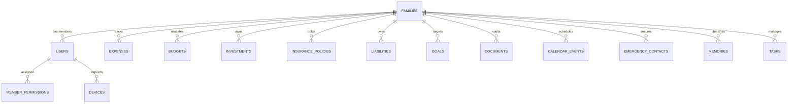

# 📘 ONE FAMILY (Famora) — Supabase Database Architecture & Technical Reference Manual

---

## 1. Project Overview & Credentials

**ONE FAMILY (Famora)** is an AI-powered Family Operating System designed with a **Multi-Tenant** relational architecture. Every family is an isolated workspace containing members, finances, assets, documents, health records, smart reminders, memories, and AI conversations.

### 🔑 Supabase Cloud Project Details

| Parameter | Value |
| :--- | :--- |
| **Project Name** | `OneFamily` / `Famora` |
| **Project Reference ID** | `imofsunuyhaqmjxxkshy` |
| **Database Engine** | PostgreSQL 15+ (Hosted on Supabase Cloud) |
| **Project REST Endpoint** | `https://imofsunuyhaqmjxxkshy.supabase.co/rest/v1/` |
| **Project Public URL** | `https://imofsunuyhaqmjxxkshy.supabase.co` |
| **Anon / Publishable API Key** | `sb_publishable_bMCHUQpEqI_dN1ba-H5Psg_OCiyrWa2` |
| **Service Role Key** | Configured in server `.env` as `SUPABASE_SERVICE_ROLE_KEY` *(Bypasses RLS for backend replication)* |
| **Live App Deployment** | `https://onefamily-ydkb.onrender.com` |

---

## 2. Multi-Tenancy & Security Architecture



### Multi-Tenant Isolation
- **Tenant Root (`families`)**: Every family entity has a unique `id` (e.g. `fam_178...`) and a human-friendly unique code `family_key` (e.g. `RAM-XYZ`).
- **Cascade Rule**: All entity tables reference `families(id) ON DELETE CASCADE`. If a family is removed, all associated expenses, documents, reminders, and user profiles are cleanly and automatically purged.
- **Role Hierarchy**:
  - `FAMILY_HEAD`: Full administrative permissions, billing management, inviting/removing members, editing financial vaults.
  - `SPOUSE`: Co-admin permissions for finances, health, documents, and scheduling.
  - `ADULT`: Manage personal expenses, tasks, shared grocery lists, view family records.
  - `CHILD`: Restricted access to chore tasks, allowances/goals, school events.
  - `VIEWER`: Read-only access to selected family events and emergency contacts.

---

## 3. Exhaustive Table-by-Table Reference (All 25 Tables)

### Group A: Family Core & Access Management (Tables 1–6)

#### 1. `families`
* **Purpose**: Root multi-tenant entity representing a distinct household/family workspace.
* **Primary Key**: `id` (`TEXT`)
* **Unique Keys**: `family_key`
* **Indexes**: Primary Key on `id`, Unique on `family_key`.

| Column | Type | Constraints | Description |
| :--- | :--- | :--- | :--- |
| `id` | `TEXT` | `PRIMARY KEY` | Unique family UUID / generated ID |
| `name` | `TEXT` | `NOT NULL` | Display name of the family (e.g., "Bondada Family") |
| `family_key` | `TEXT` | `UNIQUE` | Human-friendly alphanumeric join key (e.g., `RAM-VA34`) |
| `photo_url` | `TEXT` | Nullable | URL to family cover photo or emblem |
| `location` | `TEXT` | Nullable | Primary city/residence of the family |
| `currency` | `TEXT` | `DEFAULT 'INR'` | Default currency ISO code (INR, USD, EUR, etc.) |
| `language` | `TEXT` | `DEFAULT 'en'` | Default interface language (en, hi, te, etc.) |
| `created_at` | `TEXT` | `NOT NULL` | ISO 8601 creation timestamp |
| `updated_at` | `TEXT` | `NOT NULL` | ISO 8601 modification timestamp |

---

#### 2. `users`
* **Purpose**: Individual family members, heads, spouses, adults, and children.
* **Primary Key**: `id` (`TEXT`)
* **Foreign Keys**: `family_id` $\rightarrow$ `families(id)` (`ON DELETE CASCADE`)
* **Unique Keys**: `email`

| Column | Type | Constraints | Description |
| :--- | :--- | :--- | :--- |
| `id` | `TEXT` | `PRIMARY KEY` | Unique user identifier |
| `family_id` | `TEXT` | `NOT NULL, FK` | Foreign key referencing `families.id` |
| `email` | `TEXT` | `UNIQUE` | User email for login & communications |
| `phone` | `TEXT` | Nullable | Mobile phone number with country code |
| `name` | `TEXT` | `NOT NULL` | Full member name |
| `password_hash`| `TEXT` | `NOT NULL` | Encrypted authentication password |
| `pin_code` | `TEXT` | Nullable | 4-digit quick lock/unlock PIN |
| `avatar_url` | `TEXT` | Nullable | Profile photo URL |
| `role` | `TEXT` | `DEFAULT 'ADULT'`| `FAMILY_HEAD`, `SPOUSE`, `ADULT`, `CHILD`, `VIEWER` |
| `relationship` | `TEXT` | Nullable | Relationship to head (e.g., "Father", "Spouse", "Son") |
| `birth_date` | `TEXT` | Nullable | Date of birth (YYYY-MM-DD) |
| `created_at` | `TEXT` | `NOT NULL` | ISO 8601 member registration timestamp |

---

#### 3. `permissions`
* **Purpose**: Master registry of fine-grained granular permissions that can be assigned to members.
* **Primary Key**: `id` (`TEXT`)
* **Unique Keys**: `code`

| Column | Type | Constraints | Description |
| :--- | :--- | :--- | :--- |
| `id` | `TEXT` | `PRIMARY KEY` | Unique permission ID |
| `code` | `TEXT` | `UNIQUE, NOT NULL`| Permission code string (e.g., `FINANCE_VIEW`, `VAULT_EDIT`) |
| `name` | `TEXT` | `NOT NULL` | Human-readable title |
| `category` | `TEXT` | `NOT NULL` | Feature area (`FINANCE`, `VAULT`, `HEALTH`, `ADMIN`) |

---

#### 4. `member_permissions`
* **Purpose**: Junction table connecting users to explicit custom permissions.
* **Primary Key**: Composite `(user_id, permission_code)`
* **Foreign Keys**: `user_id` $\rightarrow$ `users(id)` (`ON DELETE CASCADE`)

| Column | Type | Constraints | Description |
| :--- | :--- | :--- | :--- |
| `user_id` | `TEXT` | `NOT NULL, FK` | Target user ID |
| `permission_code`| `TEXT` | `NOT NULL` | Permission code granted to user |

---

#### 5. `devices`
* **Purpose**: Tracks active login sessions, trusted hardware, and browsers per user.
* **Primary Key**: `id` (`TEXT`)
* **Foreign Keys**: `user_id` $\rightarrow$ `users(id)` (`ON DELETE CASCADE`)

| Column | Type | Constraints | Description |
| :--- | :--- | :--- | :--- |
| `id` | `TEXT` | `PRIMARY KEY` | Session/Device identifier |
| `user_id` | `TEXT` | `NOT NULL, FK` | Associated user ID |
| `device_name`| `TEXT` | `NOT NULL` | Hardware descriptor (e.g., "iPhone 15 Pro", "Chrome on Windows") |
| `browser` | `TEXT` | Nullable | Browser engine & version |
| `os` | `TEXT` | Nullable | Operating system name |
| `ip_address` | `TEXT` | Nullable | Client IP at login |
| `last_active`| `TEXT` | `NOT NULL` | Last heartbeat/activity timestamp |
| `is_current` | `BOOLEAN`| `DEFAULT FALSE`| Flag if current active session |

---

#### 6. `audit_logs`
* **Purpose**: Immutable security audit trail recording critical actions (logins, vault reads, member removals).
* **Primary Key**: `id` (`TEXT`)
* **Foreign Keys**: `family_id` $\rightarrow$ `families(id)` (`ON DELETE CASCADE`)

| Column | Type | Constraints | Description |
| :--- | :--- | :--- | :--- |
| `id` | `TEXT` | `PRIMARY KEY` | Unique log entry ID |
| `family_id` | `TEXT` | `NOT NULL, FK` | Family tenant scope |
| `user_id` | `TEXT` | `NOT NULL` | ID of the acting user |
| `user_name` | `TEXT` | `NOT NULL` | Snapshot of member's name at time of action |
| `action` | `TEXT` | `NOT NULL` | Action performed (e.g., `MEMBER_REMOVED`, `DOCUMENT_DOWNLOADED`) |
| `category` | `TEXT` | `NOT NULL` | Module category (`AUTH`, `FINANCE`, `VAULT`, `MEMBERS`) |
| `details` | `TEXT` | Nullable | Extended JSON or descriptive details |
| `created_at` | `TEXT` | `NOT NULL` | Event timestamp |

---

### Group B: Financial Management (Tables 7–13)

#### 7. `expense_categories`
* **Purpose**: Built-in and custom categorization tags for household cash flow.
* **Primary Key**: `id` (`TEXT`)

| Column | Type | Constraints | Description |
| :--- | :--- | :--- | :--- |
| `id` | `TEXT` | `PRIMARY KEY` | Category ID (e.g., `cat_groceries`) |
| `family_id` | `TEXT` | `NOT NULL` | Family ID scope |
| `name` | `TEXT` | `NOT NULL` | Category name (e.g., "Groceries", "Utilities") |
| `icon` | `TEXT` | `NOT NULL` | Lucide icon identifier |
| `color` | `TEXT` | `NOT NULL` | UI badge hex color |
| `is_custom` | `BOOLEAN`| `DEFAULT FALSE`| True if custom-created by the family |

---

#### 8. `expenses`
* **Purpose**: Daily debit and credit expenditure records across family members.
* **Primary Key**: `id` (`TEXT`)
* **Foreign Keys**: `family_id` $\rightarrow$ `families(id)` (`ON DELETE CASCADE`)

| Column | Type | Constraints | Description |
| :--- | :--- | :--- | :--- |
| `id` | `TEXT` | `PRIMARY KEY` | Expense entry ID |
| `family_id` | `TEXT` | `NOT NULL, FK` | Family tenant scope |
| `user_id` | `TEXT` | `NOT NULL` | ID of member who incurred/logged expense |
| `paid_by_name` | `TEXT` | `NOT NULL` | Member name snapshot |
| `category_id` | `TEXT` | `NOT NULL` | References category ID |
| `category_name`| `TEXT` | `NOT NULL` | Category label snapshot |
| `amount` | `REAL` | `NOT NULL` | Expense value (numeric) |
| `currency` | `TEXT` | `DEFAULT 'INR'` | Transaction currency |
| `date` | `TEXT` | `NOT NULL` | Date of expense (YYYY-MM-DD) |
| `payment_method`| `TEXT` | `NOT NULL` | `UPI`, `CASH`, `CREDIT_CARD`, `DEBIT_CARD`, `BANK_TRANSFER`, `WALLET` |
| `merchant` | `TEXT` | Nullable | Vendor/merchant name |
| `notes` | `TEXT` | Nullable | Description or comment |
| `location` | `TEXT` | Nullable | Store / city location |
| `receipt_url` | `TEXT` | Nullable | Scanned bill/receipt image URL |
| `split_type` | `TEXT` | `DEFAULT 'EQUAL'`| `NONE`, `EQUAL`, `CUSTOM` |
| `created_at` | `TEXT` | `NOT NULL` | Timestamp logged |

---

#### 9. `budgets`
* **Purpose**: Monthly spending caps per category to track budget variance.
* **Primary Key**: `id` (`TEXT`)
* **Foreign Keys**: `family_id` $\rightarrow$ `families(id)` (`ON DELETE CASCADE`)

| Column | Type | Constraints | Description |
| :--- | :--- | :--- | :--- |
| `id` | `TEXT` | `PRIMARY KEY` | Budget rule ID |
| `family_id` | `TEXT` | `NOT NULL, FK` | Family tenant scope |
| `category_id` | `TEXT` | `NOT NULL` | Category being budgeted |
| `category_name`| `TEXT` | `NOT NULL` | Category label snapshot |
| `monthly_limit`| `REAL` | `NOT NULL` | Maximum budget threshold in base currency |
| `month_year` | `TEXT` | `NOT NULL` | Applicable cycle (e.g. `2026-09`) |
| `created_at` | `TEXT` | `NOT NULL` | Creation timestamp |

---

#### 10. `investments`
* **Purpose**: Wealth portfolio tracking (Mutual Funds, Stocks, Gold, Fixed Deposits, PPF, Bonds).
* **Primary Key**: `id` (`TEXT`)
* **Foreign Keys**: `family_id` $\rightarrow$ `families(id)` (`ON DELETE CASCADE`)

| Column | Type | Constraints | Description |
| :--- | :--- | :--- | :--- |
| `id` | `TEXT` | `PRIMARY KEY` | Investment asset ID |
| `family_id` | `TEXT` | `NOT NULL, FK` | Family tenant scope |
| `user_id` | `TEXT` | `NOT NULL` | Owner member user ID |
| `owner_name` | `TEXT` | `NOT NULL` | Owner member name |
| `type` | `TEXT` | `NOT NULL` | `MUTUAL_FUND`, `STOCK`, `SIP`, `FIXED_DEPOSIT`, `GOLD`, `PPF`, `BONDS`, `OTHER` |
| `title` | `TEXT` | `NOT NULL` | Asset/Fund name (e.g., "HDFC Top 100 Index Fund") |
| `institution` | `TEXT` | Nullable | Bank/AMC/Broker name |
| `invested_amount`| `REAL` | `NOT NULL` | Total principal invested |
| `current_value`| `REAL` | `NOT NULL` | Current market valuation |
| `gain_loss` | `REAL` | `NOT NULL` | Unrealized net profit/loss |
| `maturity_date`| `TEXT` | Nullable | FD/Bond maturity date |
| `folio_number` | `TEXT` | Nullable | Account/folio/demat reference |
| `nominee` | `TEXT` | Nullable | Registered nominee name |
| `notes` | `TEXT` | Nullable | Investment notes |
| `updated_at` | `TEXT` | `NOT NULL` | Last valuation update timestamp |

---

#### 11. `insurance_policies`
* **Purpose**: Life, Health, Motor, and Home insurance policy repository with renewal reminders.
* **Primary Key**: `id` (`TEXT`)
* **Foreign Keys**: `family_id` $\rightarrow$ `families(id)` (`ON DELETE CASCADE`)

| Column | Type | Constraints | Description |
| :--- | :--- | :--- | :--- |
| `id` | `TEXT` | `PRIMARY KEY` | Policy ID |
| `family_id` | `TEXT` | `NOT NULL, FK` | Family tenant scope |
| `user_id` | `TEXT` | `NOT NULL` | Insured member user ID |
| `insured_person`| `TEXT` | `NOT NULL` | Insured individual's name |
| `policy_type` | `TEXT` | `NOT NULL` | `LIFE`, `HEALTH`, `VEHICLE`, `HOME`, `OTHER` |
| `provider` | `TEXT` | `NOT NULL` | Insurance company name (e.g., "Star Health", "LIC") |
| `policy_number`| `TEXT` | Nullable | Policy reference number |
| `sum_insured` | `REAL` | `NOT NULL` | Total cover / sum assured amount |
| `premium_amount`| `REAL` | `NOT NULL` | Annual/periodic premium payment |
| `renewal_date` | `TEXT` | `NOT NULL` | Next premium due date (YYYY-MM-DD) |
| `nominee` | `TEXT` | Nullable | Stated policy beneficiary |
| `status` | `TEXT` | `DEFAULT 'ACTIVE'`| `ACTIVE`, `LAPSED`, `EXPIRED`, `CLAIMED` |
| `document_url` | `TEXT` | Nullable | Copy of the policy bond/PDF |
| `created_at` | `TEXT` | `NOT NULL` | Record creation timestamp |

---

#### 12. `liabilities`
* **Purpose**: Loans, Mortgages, Car EMIs, and Credit liabilities tracking.
* **Primary Key**: `id` (`TEXT`)
* **Foreign Keys**: `family_id` $\rightarrow$ `families(id)` (`ON DELETE CASCADE`)

| Column | Type | Constraints | Description |
| :--- | :--- | :--- | :--- |
| `id` | `TEXT` | `PRIMARY KEY` | Liability item ID |
| `family_id` | `TEXT` | `NOT NULL, FK` | Family tenant scope |
| `user_id` | `TEXT` | `NOT NULL` | Debtor user ID |
| `owner_name` | `TEXT` | `NOT NULL` | Primary loan borrower name |
| `type` | `TEXT` | `NOT NULL` | `HOME_LOAN`, `PERSONAL_LOAN`, `VEHICLE_LOAN`, `CREDIT_CARD`, `OTHER` |
| `title` | `TEXT` | `NOT NULL` | Loan title (e.g., "SBI Home Loan Flat 402") |
| `lender` | `TEXT` | `NOT NULL` | Financial institution/bank |
| `total_loan` | `REAL` | `NOT NULL` | Initial principal sanctioned |
| `outstanding_amount`| `REAL`| `NOT NULL` | Remaining balance to be paid |
| `monthly_emi` | `REAL` | `NOT NULL` | Monthly installment debit |
| `interest_rate`| `REAL` | Nullable | Annual interest percentage |
| `end_date` | `TEXT` | Nullable | Loan tenure completion date |
| `created_at` | `TEXT` | `NOT NULL` | Record creation timestamp |

---

#### 13. `goals`
* **Purpose**: Long-term and short-term collective family savings targets.
* **Primary Key**: `id` (`TEXT`)
* **Foreign Keys**: `family_id` $\rightarrow$ `families(id)` (`ON DELETE CASCADE`)

| Column | Type | Constraints | Description |
| :--- | :--- | :--- | :--- |
| `id` | `TEXT` | `PRIMARY KEY` | Goal ID |
| `family_id` | `TEXT` | `NOT NULL, FK` | Family tenant scope |
| `title` | `TEXT` | `NOT NULL` | Goal title (e.g., "Higher Education Fund", "Euro Vacation") |
| `category` | `TEXT` | `NOT NULL` | `EMERGENCY_FUND`, `EDUCATION`, `HOUSE`, `VACATION`, `RETIREMENT`, `MARRIAGE`, `CAR`, `OTHER` |
| `target_amount`| `REAL` | `NOT NULL` | Total target savings |
| `current_amount`| `REAL` | `NOT NULL` | Amount saved to date |
| `monthly_contribution`| `REAL`| `NOT NULL` | Monthly allocated savings |
| `target_date` | `TEXT` | `NOT NULL` | Target completion date (YYYY-MM-DD) |
| `priority` | `TEXT` | `DEFAULT 'MEDIUM'`| `HIGH`, `MEDIUM`, `LOW` |
| `status` | `TEXT` | `DEFAULT 'IN_PROGRESS'`| `IN_PROGRESS`, `ACHIEVED`, `PAUSED` |
| `contributors` | `TEXT` | Nullable | JSON array of member names contributing |
| `created_at` | `TEXT` | `NOT NULL` | Creation timestamp |

---

### Group C: Organization, Calendar & Vault (Tables 14–17)

#### 14. `calendar_events`
* **Purpose**: Central family calendar for milestones, birthdays, anniversaries, doctor appointments, and school events.
* **Primary Key**: `id` (`TEXT`)
* **Foreign Keys**: `family_id` $\rightarrow$ `families(id)` (`ON DELETE CASCADE`)

| Column | Type | Constraints | Description |
| :--- | :--- | :--- | :--- |
| `id` | `TEXT` | `PRIMARY KEY` | Event ID |
| `family_id` | `TEXT` | `NOT NULL, FK` | Family tenant scope |
| `created_by_id`| `TEXT` | `NOT NULL` | Creator user ID |
| `title` | `TEXT` | `NOT NULL` | Event title |
| `type` | `TEXT` | `NOT NULL` | `BIRTHDAY`, `ANNIVERSARY`, `SCHOOL`, `BILL`, `INSURANCE`, `SIP`, `MEDICAL`, `TRAVEL`, `FUNCTION`, `RELIGIOUS`, `OTHER` |
| `start_date` | `TEXT` | `NOT NULL` | Start ISO timestamp / Date |
| `end_date` | `TEXT` | Nullable | End ISO timestamp / Date |
| `is_all_day` | `BOOLEAN`| `DEFAULT TRUE` | All-day event indicator |
| `assigned_member_id`| `TEXT` | Nullable | Assigned focal member ID |
| `assigned_member_name`| `TEXT`| Nullable | Member name snapshot |
| `is_recurring`| `BOOLEAN`| `DEFAULT FALSE`| Recurrence flag |
| `recurrence_rule`| `TEXT`| Nullable | Recurrence frequency (`YEARLY`, `MONTHLY`, `WEEKLY`) |
| `visibility` | `TEXT` | `DEFAULT 'FAMILY'`| `FAMILY`, `PRIVATE` |
| `notes` | `TEXT` | Nullable | Event notes or address |
| `created_at` | `TEXT` | `NOT NULL` | Record creation timestamp |

---

#### 15. `reminders`
* **Purpose**: Automated notifications for bills, subscription renewals, medicines, and chores.
* **Primary Key**: `id` (`TEXT`)
* **Foreign Keys**: `family_id` $\rightarrow$ `families(id)` (`ON DELETE CASCADE`)

| Column | Type | Constraints | Description |
| :--- | :--- | :--- | :--- |
| `id` | `TEXT` | `PRIMARY KEY` | Reminder ID |
| `family_id` | `TEXT` | `NOT NULL, FK` | Family tenant scope |
| `title` | `TEXT` | `NOT NULL` | Reminder headline |
| `due_date` | `TEXT` | `NOT NULL` | Due date timestamp |
| `category` | `TEXT` | `NOT NULL` | `BILL`, `MEDICINE`, `RENEWAL`, `TASK`, `OTHER` |
| `lead_days` | `INTEGER`| `DEFAULT 3` | Days in advance to start alerting |
| `is_dismissed` | `BOOLEAN`| `DEFAULT FALSE`| Dismissed/acknowledged flag |
| `linked_entity_type`| `TEXT`| Nullable | Associated model (`INSURANCE`, `TASK`, `LIABILITY`) |
| `linked_entity_id`| `TEXT` | Nullable | ID of associated model |
| `created_at` | `TEXT` | `NOT NULL` | Creation timestamp |

---

#### 16. `document_categories`
* **Purpose**: Folders for digital document organization (KYC, Medical, Property, Vehicles, Tax).
* **Primary Key**: `id` (`TEXT`)

| Column | Type | Constraints | Description |
| :--- | :--- | :--- | :--- |
| `id` | `TEXT` | `PRIMARY KEY` | Category identifier |
| `name` | `TEXT` | `NOT NULL` | Category name (e.g., "Identity & KYC", "Health Records") |
| `icon` | `TEXT` | `NOT NULL` | Icon identifier |
| `description` | `TEXT` | Nullable | Folder description |
| `is_sensitive` | `BOOLEAN`| `DEFAULT FALSE`| Requires PIN/password confirmation to view |

---

#### 17. `documents`
* **Purpose**: Encrypted digital vault files with metadata, OCR text extraction, and expiration dates.
* **Primary Key**: `id` (`TEXT`)
* **Foreign Keys**: `family_id` $\rightarrow$ `families(id)` (`ON DELETE CASCADE`)

| Column | Type | Constraints | Description |
| :--- | :--- | :--- | :--- |
| `id` | `TEXT` | `PRIMARY KEY` | Document ID |
| `family_id` | `TEXT` | `NOT NULL, FK` | Family tenant scope |
| `uploaded_by_id`| `TEXT` | `NOT NULL` | Uploader user ID |
| `owner_name` | `TEXT` | `NOT NULL` | Member document belongs to |
| `title` | `TEXT` | `NOT NULL` | Document title (e.g. "Passport - Rambabu") |
| `category_id` | `TEXT` | `NOT NULL` | Category folder reference |
| `document_number`| `TEXT` | Nullable | Official ID/license/policy number |
| `issue_date` | `TEXT` | Nullable | Date of issuance |
| `expiry_date` | `TEXT` | Nullable | Validity expiration date |
| `issuer` | `TEXT` | Nullable | Issuing authority (e.g., "Govt of India", "UIDAI") |
| `file_url` | `TEXT` | `NOT NULL` | Secure file URL / Cloud storage path |
| `file_type` | `TEXT` | `NOT NULL` | MIME type or extension (`PDF`, `PNG`, `JPG`) |
| `file_size_kb`| `INTEGER`| Nullable | File size in kilobytes |
| `tags` | `TEXT` | Nullable | Comma-separated search tags |
| `notes` | `TEXT` | Nullable | Extra user notes |
| `ocr_extracted_text`| `TEXT`| Nullable | Full searchable text extracted via AI/OCR |
| `is_verified` | `BOOLEAN`| `DEFAULT TRUE` | Verification check flag |
| `created_at` | `TEXT` | `NOT NULL` | Upload timestamp |

---

### Group D: Health, Emergency & Memories (Tables 18–21)

#### 18. `emergency_contacts`
* **Purpose**: SOS directory containing family doctors, hospitals, ambulance, police, and relatives.
* **Primary Key**: `id` (`TEXT`)
* **Foreign Keys**: `family_id` $\rightarrow$ `families(id)` (`ON DELETE CASCADE`)

| Column | Type | Constraints | Description |
| :--- | :--- | :--- | :--- |
| `id` | `TEXT` | `PRIMARY KEY` | Contact ID |
| `family_id` | `TEXT` | `NOT NULL, FK` | Family tenant scope |
| `name` | `TEXT` | `NOT NULL` | Doctor / facility / contact name |
| `relationship` | `TEXT` | `NOT NULL` | Relationship or role (e.g., "Pediatrician", "Brother") |
| `phone` | `TEXT` | `NOT NULL` | Primary emergency contact number |
| `secondary_phone`| `TEXT`| Nullable | Secondary phone number |
| `email` | `TEXT` | Nullable | Email address |
| `type` | `TEXT` | `DEFAULT 'PERSONAL'`| `PERSONAL`, `DOCTOR`, `HOSPITAL`, `AMBULANCE`, `POLICE`, `INSURANCE` |
| `address` | `TEXT` | Nullable | Physical address/hospital location |
| `is_primary` | `BOOLEAN`| `DEFAULT FALSE`| Top priority SOS contact flag |
| `created_at` | `TEXT` | `NOT NULL` | Record creation timestamp |

---

#### 19. `emergency_profiles`
* **Purpose**: Critical medical health cards per member (Blood Group, Allergies, Chronic Conditions, Regular Medications).
* **Primary Key**: `id` (`TEXT`)
* **Foreign Keys**: `family_id` $\rightarrow$ `families(id)` (`ON DELETE CASCADE`)

| Column | Type | Constraints | Description |
| :--- | :--- | :--- | :--- |
| `id` | `TEXT` | `PRIMARY KEY` | Health profile ID |
| `family_id` | `TEXT` | `NOT NULL, FK` | Family tenant scope |
| `user_id` | `TEXT` | `NOT NULL` | Target member user ID |
| `full_name` | `TEXT` | `NOT NULL` | Patient full name |
| `blood_group` | `TEXT` | `NOT NULL` | Blood type (e.g., `O+`, `B+`, `A-`, `AB+`) |
| `allergies` | `TEXT` | Nullable | Known allergies (e.g. "Penicillin, Peanuts") |
| `chronic_conditions`| `TEXT`| Nullable | Chronic ailments (e.g. "Type 2 Diabetes", "Hypertension") |
| `medications` | `TEXT` | Nullable | Daily prescriptions and dosage |
| `primary_doctor`| `TEXT`| Nullable | Attending doctor contact |
| `insurance_summary`| `TEXT`| Nullable | Quick reference policy ID and TPA contact |
| `special_instructions`| `TEXT`| Nullable | Crucial first-responder instructions |
| `updated_at` | `TEXT` | `NOT NULL` | Last medical update timestamp |

---

#### 20. `memories`
* **Purpose**: Family timeline, photo albums, vacation diaries, and milestone celebrations.
* **Primary Key**: `id` (`TEXT`)
* **Foreign Keys**: `family_id` $\rightarrow$ `families(id)` (`ON DELETE CASCADE`)

| Column | Type | Constraints | Description |
| :--- | :--- | :--- | :--- |
| `id` | `TEXT` | `PRIMARY KEY` | Memory entry ID |
| `family_id` | `TEXT` | `NOT NULL, FK` | Family tenant scope |
| `title` | `TEXT` | `NOT NULL` | Memory title (e.g., "Goa Summer Holiday 2025") |
| `date` | `TEXT` | `NOT NULL` | Date of the occasion |
| `location` | `TEXT` | Nullable | Geolocation or venue name |
| `album` | `TEXT` | Nullable | Album category name |
| `description` | `TEXT` | Nullable | Story / diary narrative |
| `photos` | `TEXT` | Nullable | JSON array of photo URLs |
| `tagged_members`| `TEXT`| Nullable | JSON array of tagged member names |
| `created_at` | `TEXT` | `NOT NULL` | Creation timestamp |

---

#### 21. `voice_memories`
* **Purpose**: Audio recordings of elder wisdom, bedtime stories, recipes, with AI speech transcription and multi-language translation.
* **Primary Key**: `id` (`TEXT`)
* **Foreign Keys**: `family_id` $\rightarrow$ `families(id)` (`ON DELETE CASCADE`)

| Column | Type | Constraints | Description |
| :--- | :--- | :--- | :--- |
| `id` | `TEXT` | `PRIMARY KEY` | Voice memory ID |
| `family_id` | `TEXT` | `NOT NULL, FK` | Family tenant scope |
| `speaker_name` | `TEXT` | `NOT NULL` | Person speaking (e.g. "Grandmother", "Rambabu") |
| `speaker_relationship`| `TEXT`| `NOT NULL`| Family role |
| `title` | `TEXT` | `NOT NULL` | Audio title (e.g. "Traditional Mango Pickle Recipe") |
| `date` | `TEXT` | `NOT NULL` | Recording date |
| `audio_url` | `TEXT` | `NOT NULL` | URL to audio storage file (MP3/WAV/AAC) |
| `duration_seconds`| `INTEGER`| `NOT NULL`| Playback duration in seconds |
| `transcript` | `TEXT` | `NOT NULL` | Speech-to-text full transcription |
| `translation_hindi`| `TEXT`| Nullable | AI Hindi translation |
| `translation_telugu`| `TEXT`| Nullable | AI Telugu translation |
| `created_at` | `TEXT` | `NOT NULL` | Creation timestamp |

---

### Group E: Household Operations, Notifications & AI (Tables 22–25)

#### 22. `tasks`
* **Purpose**: Household chore tracking, task assignments, due dates, and completion status.
* **Primary Key**: `id` (`TEXT`)
* **Foreign Keys**: `family_id` $\rightarrow$ `families(id)` (`ON DELETE CASCADE`)

| Column | Type | Constraints | Description |
| :--- | :--- | :--- | :--- |
| `id` | `TEXT` | `PRIMARY KEY` | Task item ID |
| `family_id` | `TEXT` | `NOT NULL, FK` | Family tenant scope |
| `title` | `TEXT` | `NOT NULL` | Task description |
| `category` | `TEXT` | `NOT NULL` | `CHORE`, `GROCERY`, `BILL`, `MAINTENANCE`, `SCHOOL`, `OTHER` |
| `priority` | `TEXT` | `DEFAULT 'MEDIUM'`| `HIGH`, `MEDIUM`, `LOW` |
| `status` | `TEXT` | `DEFAULT 'PENDING'`| `PENDING`, `IN_PROGRESS`, `COMPLETED` |
| `assigned_to_id`| `TEXT` | Nullable | Assignee user ID |
| `assigned_to_name`| `TEXT`| Nullable | Assignee name snapshot |
| `due_date` | `TEXT` | Nullable | Target due date |
| `is_recurring` | `BOOLEAN`| `DEFAULT FALSE`| Auto-recurring task flag |
| `completed_at` | `TEXT` | Nullable | Timestamp of completion |
| `created_at` | `TEXT` | `NOT NULL` | Creation timestamp |

---

#### 23. `grocery_items`
* **Purpose**: Live collaborative family grocery and supplies checklist.
* **Primary Key**: `id` (`TEXT`)
* **Foreign Keys**: `family_id` $\rightarrow$ `families(id)` (`ON DELETE CASCADE`)

| Column | Type | Constraints | Description |
| :--- | :--- | :--- | :--- |
| `id` | `TEXT` | `PRIMARY KEY` | Grocery item ID |
| `family_id` | `TEXT` | `NOT NULL, FK` | Family tenant scope |
| `item_name` | `TEXT` | `NOT NULL` | Item description (e.g., "Organic Cow Milk 2L") |
| `quantity` | `TEXT` | `NOT NULL` | Quantity and unit |
| `category` | `TEXT` | `NOT NULL` | `PRODUCE`, `DAIRY`, `STAPLES`, `SNACKS`, `HOUSEHOLD`, `OTHER` |
| `is_purchased` | `BOOLEAN`| `DEFAULT FALSE`| Purchased / checked-off status |
| `added_by_name`| `TEXT` | `NOT NULL` | Member who added item |
| `created_at` | `TEXT` | `NOT NULL` | Creation timestamp |

---

#### 24. `maintenance_items`
* **Purpose**: Appliance and vehicle service tracker (AC servicing, RO filter change, Car maintenance).
* **Primary Key**: `id` (`TEXT`)
* **Foreign Keys**: `family_id` $\rightarrow$ `families(id)` (`ON DELETE CASCADE`)

| Column | Type | Constraints | Description |
| :--- | :--- | :--- | :--- |
| `id` | `TEXT` | `PRIMARY KEY` | Maintenance schedule ID |
| `family_id` | `TEXT` | `NOT NULL, FK` | Family tenant scope |
| `item_name` | `TEXT` | `NOT NULL` | Appliance/Vehicle name (e.g., "Living Room Daikin AC") |
| `service_type` | `TEXT` | `NOT NULL` | `AC`, `CAR`, `RO_FILTER`, `GAS`, `APPLIANCE`, `PLUMBING`, `ELECTRICAL` |
| `last_service_date`| `TEXT`| `NOT NULL`| Date last serviced |
| `next_service_due`| `TEXT` | `NOT NULL` | Date next service is due |
| `service_provider`| `TEXT` | Nullable | Agency / Technician name |
| `contact_phone`| `TEXT` | Nullable | Service center phone number |
| `recurring_interval_months`| `INTEGER`| `DEFAULT 6`| Service interval frequency in months |
| `notes` | `TEXT` | Nullable | Maintenance notes or warranty info |

---

#### 25. `ai_conversations`
* **Purpose**: FamilyAI assistant context memory, tool execution history, and advice logs.
* **Primary Key**: `id` (`TEXT`)
* **Foreign Keys**: `family_id` $\rightarrow$ `families(id)` (`ON DELETE CASCADE`)

| Column | Type | Constraints | Description |
| :--- | :--- | :--- | :--- |
| `id` | `TEXT` | `PRIMARY KEY` | Interaction ID |
| `family_id` | `TEXT` | `NOT NULL, FK` | Family tenant scope |
| `user_id` | `TEXT` | `NOT NULL` | Interacting user ID |
| `role_at_time` | `TEXT` | `NOT NULL` | User's role at time of query (`FAMILY_HEAD`, `ADULT`, etc.) |
| `user_query` | `TEXT` | `NOT NULL` | Natural language question asked by member |
| `ai_response` | `TEXT` | `NOT NULL` | Synthesized AI answer and recommendations |
| `tools_called` | `TEXT` | Nullable | JSON array of tools/functions executed |
| `created_at` | `TEXT` | `NOT NULL` | Conversation timestamp |

---

## 4. Real-Time Cloud Sync & Boot Hydration Architecture

```
                      +------------------------------------------+
                      |         Supabase PostgreSQL Cloud        |
                      |  (https://imofsunuyhaqmjxxkshy.supabase) |
                      +------------------------------------------+
                                     ▲            │
                         (Upsert /   │            │  (Initial Boot
                         Deletes)    │            │   Hydration)
                                     │            ▼
                      +------------------------------------------+
                      |       Node.js / Express Backend          |
                      |        (onefamily-ydkb.onrender)         |
                      |   - db.hydrateFromSupabase() on start    |
                      |   - syncRecordToSupabase() on mutation   |
                      +------------------------------------------+
                                     ▲
                                     │ (REST APIs)
                                     ▼
                      +------------------------------------------+
                      |       React 19 Frontend Web & Mobile     |
                      +------------------------------------------+
```

1. **Boot Hydration (`db.hydrateFromSupabase()`)**:
   - When the backend starts up on Render (or locally), it queries all 25 tables from Supabase PostgreSQL.
   - It hydrates the server's transactional memory and local store with cloud data, ensuring zero data loss across Render cold starts.
2. **Instant Write-Through Sync (`syncRecordToSupabase`)**:
   - Every `create`, `update`, or `delete` in the application immediately invokes Supabase upsert/delete operations.
   - Complex types (like arrays of photos or contributor lists) are automatically sanitized into valid PostgreSQL text/JSON payloads before syncing.

---

## 5. Helpful SQL & API Query Cheat Sheet

### 1. Retrieve all family members for a specific user email
```sql
SELECT 
    u.id AS member_id,
    u.name,
    u.email,
    u.role,
    u.relationship,
    f.name AS family_name,
    f.family_key
FROM users u
JOIN families f ON u.family_id = f.id
WHERE u.family_id = (
    SELECT family_id FROM users WHERE email = 'rambabub789@gmail.com' LIMIT 1
)
ORDER BY 
    CASE 
        WHEN u.role = 'FAMILY_HEAD' THEN 1
        WHEN u.role = 'SPOUSE' THEN 2
        ELSE 3
    END;
```

### 2. Get total monthly expense breakdown by category for a family
```sql
SELECT 
    category_name,
    COUNT(*) AS transaction_count,
    SUM(amount) AS total_spent
FROM expenses
WHERE family_id = 'fam_1789400030588'
  AND date LIKE '2026-09%'
GROUP BY category_name
ORDER BY total_spent DESC;
```

### 3. Fetch Emergency Medical Summary Cards for all family members
```sql
SELECT 
    ep.full_name,
    ep.blood_group,
    ep.allergies,
    ep.chronic_conditions,
    ep.medications,
    ep.primary_doctor,
    ep.special_instructions
FROM emergency_profiles ep
WHERE ep.family_id = 'fam_1789400030588';
```

---
*Generated for ONE FAMILY (Famora) Engineering & Operations Architecture.*
